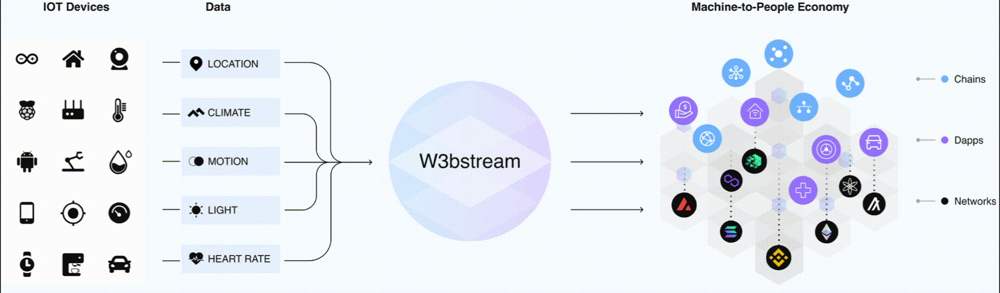

# About W3bstream


**Notice**: This documentation portal is a Work in Progress and subject to change frequently.


## Overview



W3bstream is a general framework for connecting data generated in the physical world to the blockchain world.&#x20;

In a nutshell, W3bstream uses the [IoTeX blockchain](https://docs.iotex.io) to orchestrate a decentralized network of gateways (i.e., _"W3bstream nodes"_) that streams \[optionally encrypted] data from IoT devices and machines. On top of machine data, _proofs of real-world facts_ are generated, **to be used by dApps** **on different blockchains**.&#x20;

<figure><figcaption></figcaption></figure>

Blockchain developers can build their dApps getting access to trusted real-world data using the W3bstream framework.

## W3bstream Node architecture

To support a wide range of applications and business requirements, a W3bstream node includes the following connectivity, computing, storage, and consensus components, for interacting with the IoT devices, blockchain, and node operators:

<figure><figcaption>
W3bstream Node Architecture
</figcaption></figure>

Service Endpoint

The service endpoint implements a number of communication protocols (e.g., MQTT, HTTP, RPC, etc.) to communicate with smart devices, blockchain, and node operators.

Virtual File System

The virtual file system is used to store a business program (i.e., WebAssembly modules that implement the business logic of a specific MachineFi application) as well as intermediate computation results**.**

Execution Engine

The W3bstream execution engine runs the pre-defined business logic that process incoming data from smart devices, blockchain events, and more. The execution engine is based on a WebAssembly VM and the WASI interface, and it can run multiple WASM modules in parallel.

Consensus

The consensus module implements a number of consensus algorithms (e.g., Proof of Authority -PoA, Practical Byzantine Fault Tolerance – PBFT, etc…) for realizing a decentralized W3bStream network.

Database

The database component represents an abstract storage interface and its goal is to serve as the long term storage of the raw/encrypted data received from smart devices. Different storage implementations can be plugged in: from a simple local relational database, to a decentralized storage solution like IPFS. Data retention policies can also be configured for this module, depending on the application needs.

SSI Wallet

The SSI wallet implements decentralized identifiers and verifiable credentials-related functionalities for managing identities in a W3bstream node.

## Lifecycle

The W3bstream Network incentivizes communities to run nodes for supporting the growing ecosystem of MachineFi dApps. Depending on the requirements of a specific dApp, a certain number of W3bstream nodes might be employed to serve it: such subnet of W3bstream node will start operating when the sufficient number of community nodes will have joined.

Any community member who is interested in operating a W3bstream node could provision a virtual machine on the cloud or set up a local server.


### What's next?

Checkout the [**Get Started**](sending-data-to-w3bstream/introduction.md) section to learn how to run a W3bstream node.

Learn about the fundamentals of [**programming** ](get-started/basic-concepts/)a W3bstream node.

