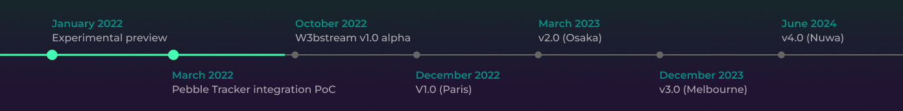

# Roadmap

The development of W3bstream will span until Q2 2024. During this time, the “_first glimpse_” version released by the end of 2022, will morph into a modular, scalable, and decentralized architecture that will accommodate multiple applications across different verticals.

<figure><figcaption></figcaption></figure>
