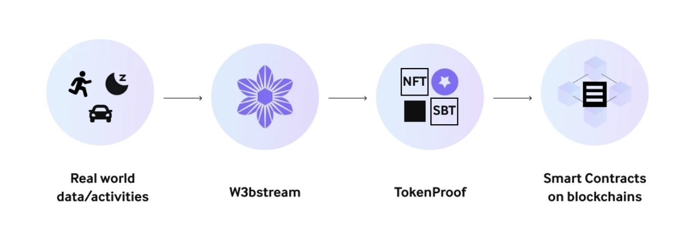

# Token Proofs

_"Token Proof"_ is the capability of W3bstream applets to initiate token rewards on a blockchain by providing reliable evidence of real-world facts, leveraging the data received from connected devices. This functionality ensures transparency and trust in a decentralized reward system, which is a fundamental requirement for any DePIN (_"Decentralized Physical Network Infrastructure"_) application.

<figure><figcaption></figcaption></figure>

Within W3bstream, a consensus mechanism is utilized among nodes assigned to a particular project. These nodes work together to process data from connected devices and collectively determine the veracity of the reported facts. Through this consensus, W3bstream establishes a definitive record of real-world events based on the device data, which smart contracts can verify. This enables the creation of NFTs or ERC20 tokens on any supported blockchain, ensuring trust and reliability in decentralized reward systems used by any DePIN application.


Please note that W3bstream is currently in its _"Devnet"_ phase and **is not fully decentralized**. However, even in its current state, the _"Token Proof"_ capability can still be utilized to verify facts and initiate secure token rewards.&#x20;

As W3bstream continues to evolve towards complete decentralization, the consensus mechanism will further enhance the trust and reliability of the _"Token Proof"_ mechanism.


👉🏻 Learn more in the <a data-mention href="../sending-blockchain-actions.md#the-operator-address">#the-operator-address</a> section

