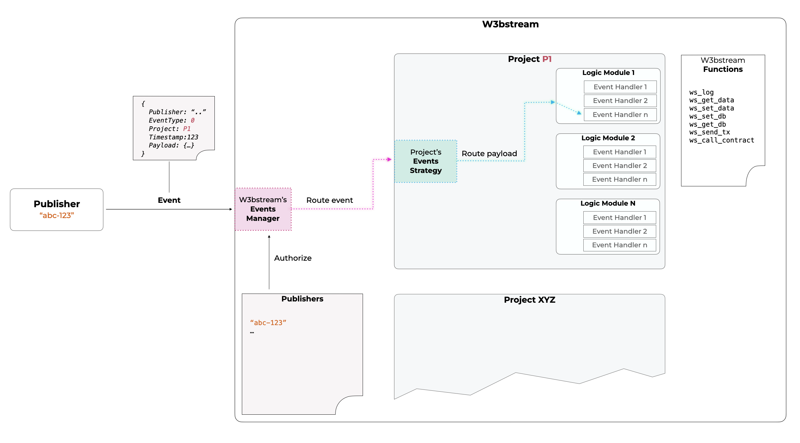

# Basic concepts

A MachineFi application can be split into three main components:&#x20;

<a href="https://emojipedia.org/satellite-antenna/">📡 </a>Smart-devices data

Whether it's a Web3-oriented smart device newly designed with dApps in mind, or one that has already existed in the market, a MachineFi application relies on data generated by a smart device.

<a href="https://emojipedia.org/gear/">⚙️  </a>IoT logic and trusted proofs 

From rewarding sleeping patterns and workout progress, over selling industrial machines as a service, to incentivizing weather data contributions to predict the global climate change, any MachineFi application has its own data processing requirements and requires trusted "proofs of real-world facts" to be generated for the Blockchain Logic.

<a href="https://emojipedia.org/link/">🔗</a>Blockchain Logic

Basic blockchain components of a MachineFi application typically include a set of Authorization-related smart contracts and an incentivizing token economy. More complex applications can include decentralized data marketplaces or DeFi functionalities.&#x20;

As anticipated in [#w3bstream-node-architecture](../../#w3bstream-node-architecture "mention"), the W3bstream framework aims to disrupt the status quo in conventional Web2-based IoT businesses and facilitate organizations and community developers to build innovative Web3-based IoT applications that enable device owners to monetize their device utilities and provide fair distribution of the value chain revenue among all the stakeholders.

In this section, we introduce the basic concepts of how W3bstream works.

<figure><figcaption></figcaption></figure>
