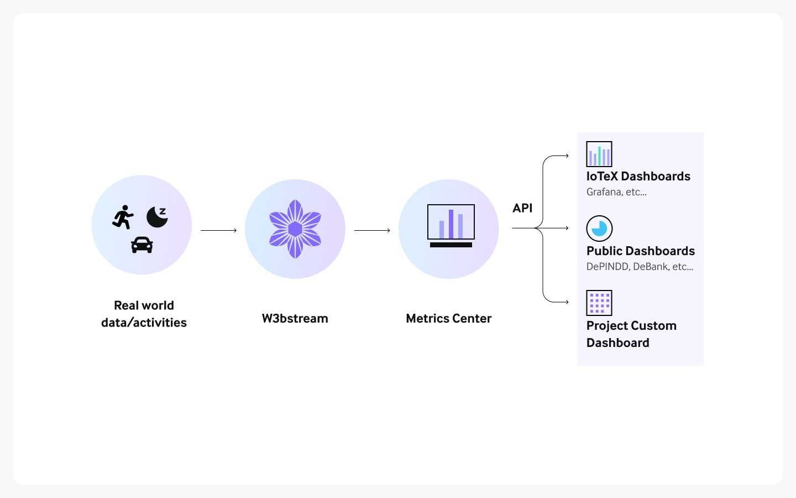

# About Trusted Metrics

W3bstream's Trusted Metrics Service is a robust and versatile feature designed to gather project metrics effortlessly and make them accessible through an API.

With Trusted Metrics, developers can harness data collected from their W3bstream projects to build custom dashboards seamlessly, enabling them to gain valuable insights into their projects' performance.

<figure><figcaption>
Trusted Metrics High-Level Architecture View
</figcaption></figure>

## Benefits of the Trusted Metrics Service

The Trusted Metrics service offered by W3bstream provides several benefits for developers:

1. **Privacy-Preserving Sharing**: With Trusted Metrics, builders can share selected metrics publicly, while ensuring the privacy and security of sensitive users' data.
2. **SQL Queries**: Trusted Metrics supports the `SQL` query language, making it easy for developers to retrieve and analyze metrics data.
3. **Serverless Architecture**: The Trusted Metrics service operates on a serverless architecture, eliminating the need for developers to manage infrastructure or worry about scalability.&#x20;

## Types of Metrics

### Device Metrics

Device Metrics are available for all W3bstream projects, and they consist of the number of all registered devices and active devices at any given time, as well as information on each data message received by a project.

One of the key benefits of Device Metrics is that they are automatically collected for each W3bstream project. This streamlined approach allows developers to focus on building their project logic, while still gaining valuable insights on the performances out-of-the-box.

### Custom Data Metrics

Custom Data Metrics provide developers with the flexibility to generate and transmit project-specific metrics from within their applets. These custom metrics can be derived from the actual data collected from devices, allowing developers to gain deeper insights into the performance and behavior of their projects.
