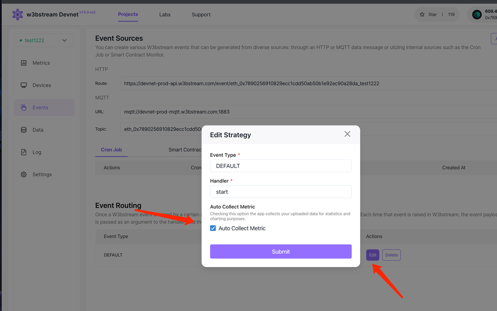

# DePINscan

<figure><figcaption>
The DePIN Global Map showing active devices around the world in real time
</figcaption></figure>

[**DePINscan**](https://depinscan.io/) DePINscan is the first microservice built on top of W3bstream as a public good, and it's meant to be a place for DePIN projects, enthusiasts, developers, and investors to learn about all the latest developments in the DePIN sector.

[**DePINscan**](https://depinscan.io/) works as an aggregate data platform that leverages the [_Trusted Metrics_ service](broken-reference) to provide information about a project's data flow, number of devices, and token-related information as well as the DePIN sector as a whole.&#x20;

## Projects Dashboard

One of the main features of [**DePINscan**](https://depinscan.io/) is the [**Projects Dashboard**](https://depinscan.io/depin):&#x20;

<figure><figcaption>
The DePINscan Projects Dashboard
</figcaption></figure>

As mentioned earlier, the dashboard offers trusted insights on a project's token, its category, what chain the project's smart contracts are deployed on, its **market cap**, **token price**, the total **number of devices**, and some info for interested end users on the **price** of the device, the estimated **earnings** and the amount of time estimated to **break even**.&#x20;

This _off-chain_ data is all powered by the W3bstream-based _Trusted Metrics_ service.&#x20;

The section below will explain how to add your project to DePINscan via _Trusted Metrics_.&#x20;

## Adding Your W3bstream Project to DePINscan

Adding your project to DePINscan is simple. If your DePIN project is already powered by W3bstream, all you have to do is check the "_Auto Collect Metric_" box for each event you'd like to share the metrics data for, in your W3bstream project's [Event Routing](../get-started/w3bstream-studio/creating-strategies.md) screen:&#x20;

<figure><figcaption>
Allow Trusted Metrics Service to collect your event data for it to be displayed in DePINscan
</figcaption></figure>


**What if my DePIN project doesn't use W3bstream yet? 🤔**\
If your DePIN project is not leveraging W3bstream yet, but you'd still like your off-chain data to be displayed in the DePINscan dashboard, and you'd like your devices to show on the global map, you'll have to simply create a new [W3bstream Project](../get-started/w3bstream-studio/creating-projects.md). \
\
Once created, you'll have to generate a new API key in your [account settings](https://devnet.w3bstream.com/setting) and use it, together with your W3bstream project's HTTPS endpoint and your device ID to send data via one of our[ client SDKs](broken-reference).&#x20;


### Showing Your Devices in the DePINscan Global Map

In order to show your devices in the DePINscan Global Map you'll have to construct the **JSON payload** sent by your device to your W3bstream Project to also include a "_latitude_" and "_longitude_" fields, such as `{"`**`latitude": 37.751, "longitude": -97.822}`.**

Once that is done, you'll have to enable the "_Auto Collect Metric_" as seen above.&#x20;
